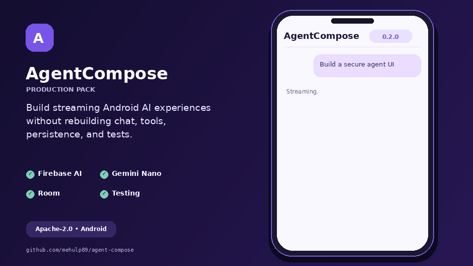

# AgentCompose

[](https://github.com/mehulp89/agent-compose/actions/workflows/build.yml)
[](LICENSE)
[](agent-compose/build.gradle.kts)
[](https://kotlinlang.org)
[](CHANGELOG.md)

An accessible, adaptive, provider-neutral AI agent UI toolkit for Jetpack Compose.

AgentCompose gives Android developers streaming conversations, Markdown, code blocks, citations,
attachments, tool approvals, errors, retries, and Material 3 components without locking an app to
one AI provider.

> **Project status:** `0.2.0` Production Pack release candidate. Source, tests, publication metadata,
> and the release workflow are included. Maven coordinates become downloadable after the maintainer
> completes the one-time Central Portal setup and publishes `v0.2.0`.



## Why AgentCompose?

Model SDKs answer prompts. Production apps still need to manage partial tokens, cancellation,
conversation state, tool permissions, errors, accessibility, and responsive UI. AgentCompose keeps
those concerns in small, testable modules:

- `agent-core` — pure Kotlin models, streaming events, conversation state, and safe tool execution.
- `agent-compose` — Material 3 UI, streaming Markdown, adaptive layout, and customization slots.
- `agent-firebase-ai` — Firebase AI Logic streaming, token usage, and function calls.
- `agent-mlkit-genai` — private on-device Gemini Nano generation through ML Kit.
- `agent-persistence-room` — durable messages, parts, drafts, errors, and token usage.
- `agent-testing` — scripted engines, request/event recorders, tool fakes, and state awaiters.
- `sample` — a completely offline demonstration that runs without an account or API key.

## Features

- Provider-neutral `AgentEngine` interface based on `Flow<AgentEvent>`
- Incremental streaming, cancellation, retry, and partial-response recovery
- Streaming-safe headings, nested/ordered lists, quotes, tables, dividers, inline Markdown, and
  copyable syntax-highlighted code blocks
- Citation, image, and file parts
- Human approval before tools execute
- First-party Firebase AI Logic and on-device ML Kit Prompt API adapters
- Normalized Room persistence and deterministic testing utilities
- Material 3 light/dark themes and localized strings
- Phone, tablet, foldable, keyboard, and screen-reader friendly layout
- Beginner API plus slot-based components for advanced teams
- No reflection and no consumer ProGuard rules
- Android API 23+ and Java 17

## Compatibility

| Component | Version |
| --- | --- |
| Android Studio | Quail 3 / `2026.1.3` Patch 1 or compatible newer stable |
| Android Gradle Plugin | `9.0.0` |
| Gradle wrapper | `9.1.0` |
| Gradle runtime | JDK 17–25; Quail 3's bundled JDK 25 is supported |
| Published bytecode | Java 17 |
| Compile / target SDK | 36 |

This deliberately avoids AGP 9.2.x, which Quail 3 rejects. Gradle 9.1 can run on Java 25, while
the library continues to publish Java 17-compatible bytecode.

## Run the sample

1. Download or clone the repository.
2. Open the repository root in the latest stable Android Studio.
3. Let Gradle sync and install Android SDK 36 if Android Studio requests it.
4. Select the `sample` run configuration.
5. Run it on an emulator or device with Android 6.0 or newer.

The sample uses a deterministic offline engine. Try these prompts:

- `Show me Kotlin code`
- `Save a note called Ideas`
- Any other question to see Markdown and a citation

## Installation

After the first Maven Central release:

```kotlin
dependencies {
    implementation("io.github.mehulp89.agentcompose:agent-compose:0.2.0")
}
```

Until then, include the source in another Gradle build:

```kotlin
// settings.gradle.kts in your app
includeBuild("../agent-compose")
```

Or publish it to your local Maven cache:

```bash
./gradlew publishToMavenLocal
```

```kotlin
// Your app's settings.gradle.kts
dependencyResolutionManagement {
    repositories {
        mavenLocal()
        google()
        mavenCentral()
    }
}
```

## Five-minute usage

Implement an engine. It can wrap Gemini Nano, Firebase AI Logic, your backend, or a test double:

```kotlin
val engine = AgentEngine { request ->
    flow {
        emit(AgentEvent.Started)
        emit(AgentEvent.TextDelta("Hello "))
        emit(AgentEvent.TextDelta(request.messages.last().text))
        emit(AgentEvent.Completed)
    }
}
```

Create state and render it:

```kotlin
@Composable
fun AssistantScreen() {
    val state = rememberAgentChatState(engine)

    AgentChat(
        state = state,
        modifier = Modifier.fillMaxSize(),
    )
}
```

For conversations that must survive navigation, create `AgentConversationController` in a
`ViewModel` and call `rememberAgentChatState(controller)` in the UI.

## Production Pack modules

Add only what your app uses:

```kotlin
dependencies {
    implementation("io.github.mehulp89.agentcompose:agent-firebase-ai:0.2.0")
    implementation("io.github.mehulp89.agentcompose:agent-mlkit-genai:0.2.0") // minSdk 26
    implementation("io.github.mehulp89.agentcompose:agent-persistence-room:0.2.0")
    testImplementation("io.github.mehulp89.agentcompose:agent-testing:0.2.0")
}
```

Firebase AI Logic keeps model configuration in your app while AgentCompose maps streaming text,
token usage, and function calls:

```kotlin
val model = Firebase.ai(
    backend = GenerativeBackend.googleAI(),
).generativeModel("gemini-2.5-flash")

val engine: AgentEngine = FirebaseAiAgentEngine(model)
```

For supported Android devices, ML Kit runs Gemini Nano on-device:

```kotlin
val manager = MlKitGenAiModelManager()
manager.prepare().collect { preparation ->
    // Render download/ready state.
}

val engine: AgentEngine = MlKitGenAiAgentEngine()
```

Persist and observe a complete conversation with Room:

```kotlin
val store = RoomConversationStore.create(applicationContext)
store.save(controller.state.value)

val restored = store.load(conversationId)
val conversations = store.observeConversations()
```

Create deterministic unit tests without a network or model:

```kotlin
val engine = ScriptedAgentEngine(
    AgentScript.text("Hello from a test", chunkSize = 5),
)
```

See [Production Pack](docs/PRODUCTION_PACK.md) for setup, limitations, and complete examples.

## Tool approval

The model requests a tool by emitting `AgentEvent.ToolCallRequested`. AgentCompose displays the
request and does nothing until the user approves or denies it.

```kotlin
val toolHandler = AgentToolHandler { call ->
    when (call.name) {
        "save_note" -> {
            notes.save(call.arguments.getValue("title"))
            ToolResultPart(call.id, "Saved")
        }
        else -> ToolResultPart(call.id, "Unknown tool", isError = true)
    }
}

val state = rememberAgentChatState(
    engine = engine,
    toolHandler = toolHandler,
)
```

Keep authorization, validation, and sensitive business rules inside your application. Treat model
arguments as untrusted input.

## Customize the UI

Use `AgentChat` for a complete default experience. Use `AgentChatLayout` when you need your own
message cards, composer, or empty state. Individual components such as `AgentMessageCard`,
`AgentComposer`, and `AgentMarkdown` can also be used independently.

Colors and labels are explicit:

```kotlin
AgentChat(
    state = state,
    colors = AgentChatDefaults.colors(
        userContainer = MaterialTheme.colorScheme.secondaryContainer,
    ),
    strings = AgentChatStrings(
        inputPlaceholder = "Ask Acme Assistant",
    ),
)
```

## Choose your learning path

| Level | Start here |
| --- | --- |
| Beginner | Run `sample`, then change `SampleAgentEngine` responses. |
| Intermediate | Choose a first-party adapter or implement `AgentEngine`, then keep the default `AgentChat`. |
| Advanced | Own the controller in a ViewModel, add Room persistence, implement tools, and use layout slots. |
| Library contributor | Read [Architecture](docs/ARCHITECTURE.md) and [Contributing](CONTRIBUTING.md). |

## Security

- Never ship OpenAI, Anthropic, or other private server API keys inside an APK.
- Prefer an authenticated backend, an on-device model, or a client-safe SDK such as Firebase AI
  Logic.
- Validate every tool name and argument before executing it.
- Ask for confirmation again for destructive or financially meaningful operations.
- Avoid logging prompts, attachments, and tool results unless the user has knowingly opted in.

See [SECURITY.md](SECURITY.md) for vulnerability reporting.

## Documentation

- [Getting started](docs/GETTING_STARTED.md)
- [Architecture and data flow](docs/ARCHITECTURE.md)
- [Writing provider adapters](docs/ADAPTERS.md)
- [Production Pack](docs/PRODUCTION_PACK.md)
- [Creating a release](docs/RELEASING.md)
- [Contributing](CONTRIBUTING.md)

## Roadmap

- Firebase App Check integration sample and emulator-backed adapter tests
- Attachment-picker and URI-to-provider content helpers
- Screenshot and accessibility regression tests
- Paging support for very large persisted histories
- Kotlin Multiplatform core evaluation

Roadmap items are proposals, not promises. Please open a feature request before implementing a
large addition.

## Contributing

Contributors of every experience level are welcome. Issues labeled `good first issue` should have a
small scope, reproduction steps, and a suggested starting point. Read [CONTRIBUTING.md](CONTRIBUTING.md)
and our [Code of Conduct](CODE_OF_CONDUCT.md) before opening a pull request.

## License

```
Copyright 2026 Mehul and AgentCompose contributors

Licensed under the Apache License, Version 2.0 (the "License");
you may not use this file except in compliance with the License.
```

See [LICENSE](LICENSE) for the complete terms.
