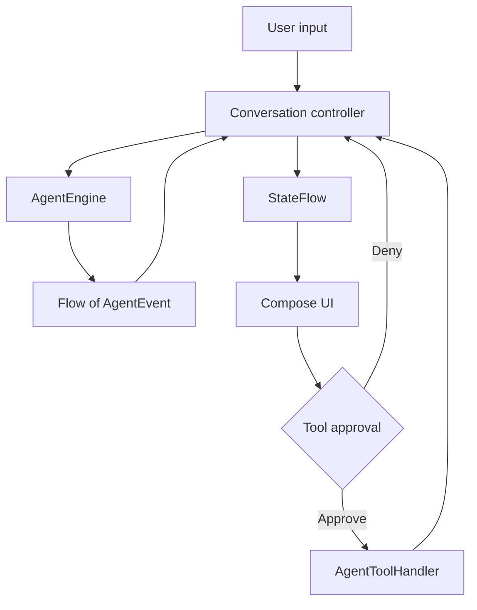

# Architecture

AgentCompose follows a small unidirectional data flow:

## Module boundaries

### `agent-core`

Pure JVM Kotlin. It must not depend on Android or Compose.

- Conversation models and parts
- Provider-neutral engine contract
- Streaming event reducer
- Tool approval and result lifecycle
- Cancellation, retry, and error state

### `agent-compose`

Android library built on Jetpack Compose and Material 3.

- Remembered state facade
- Complete conversation UI
- Slot-based advanced layout
- Lightweight streaming Markdown renderer
- Default rendering for every core message part

### Optional production modules

- `agent-firebase-ai`: Firebase AI Logic request/event mapping
- `agent-mlkit-genai`: on-device Prompt API request/event mapping
- `agent-persistence-room`: normalized Room entities and store API
- `agent-testing`: pure JVM scripts and recorders

### `sample`

Runnable teaching application. It uses a fake offline engine so every contributor can build and
test without credentials.

## Important invariants

1. `AgentConversationState` is immutable.
2. Only the controller mutates its private `MutableStateFlow`.
3. A tool never executes before an explicit decision.
4. Provider-specific objects do not cross the `AgentEngine` boundary.
5. A partial assistant message stays visible after cancellation or failure.
6. UI components do not open files, fetch images, or execute URLs themselves.

## Extending message parts

Adding a new `AgentPart` is a source-breaking exhaustiveness change for consumers using `when`.
Discuss it in an issue, add controller behavior if necessary, implement default UI, add tests, and
document provider mapping in the same pull request.

## Dependency policy

The core module intentionally has only Kotlin coroutines as a runtime dependency. The Compose
module uses AndroidX only. Provider and persistence SDKs stay in optional artifacts. New
dependencies need a clear size, maintenance, license, and security justification.
